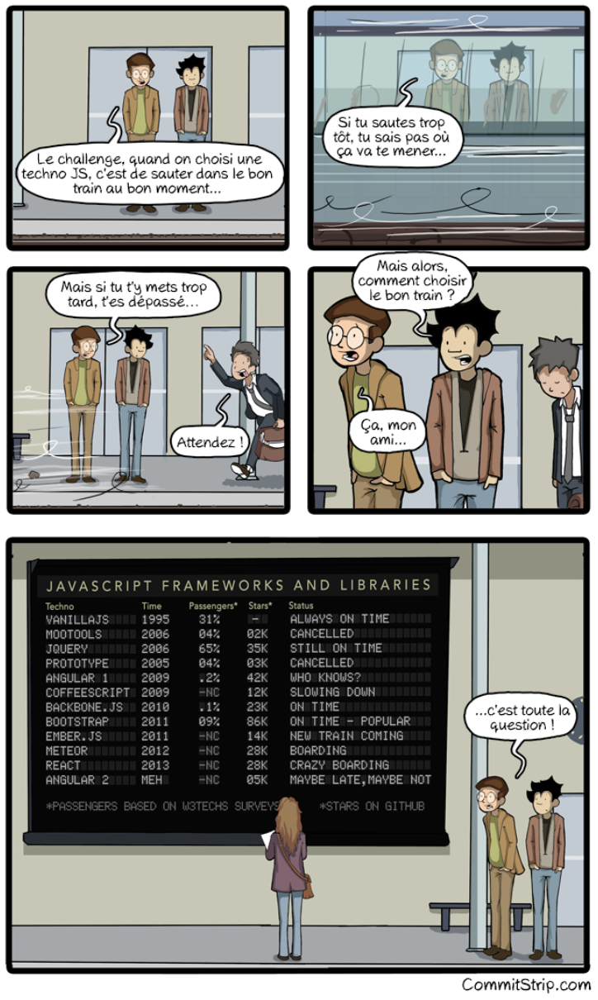
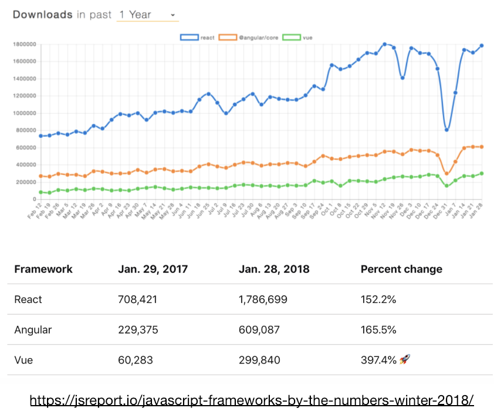

S’il est vrai qu’un langage ne laisse pas indifférent, c’est bien Javascript. 
Fort d’une immense communauté à travers le globe et d’une popularité manifeste, il n’en demeure pas moins la cible de critiques virulentes de développeurs de tous horizons.

En effet,  il est difficile (voire impossible) d’y être étranger : en plus de posséder le monopole incontesté du développement front-end, c’est aussi un véritable couteau-suisse qui a peu à peu envahi les développements back-end, mobiles et même 3D. 

Alors qu’on aurait pu le présupposer en véritable messie, unifiant les équipes de programmeurs sous un même langage et entraînant une certaine agilité entre les différents domaines d’application, le constat aujourd’hui est empreint d’un réalisme bien plus sévère.
L’effervescence de la communauté Javascript, dont l’enthousiasme et le dynamisme n’est plus à démontrer, a entraîné un effet secondaire plutôt fâcheux : l’absence de standard. Déjà décrié par lui-même pour sa syntaxe, son typage et certaines incohérences, c’est désormais la communauté qui est également visée.
Trop de librairies différentes , trop d’évolutions, trop de stacks envisageables…

Bien que cela puisse sembler tout à fait déstabilisant au premier abord, est-ce finalement vraiment un mal ? La diversité des solutions apportées, l’ardeur autour du langage et des différentes librairies ne peuvent-elles pas être un véritable avantage distinctif lorsqu’ils sont portés par une communauté soudée ?

---

## A brief history of Javascript

 
La première chose dont Javascript a eu du mal à se défaire, avant d’être perçu comme un authentique langage de programmation et pas uniquement en tant que langage de scripting, est de son origine un peu douteuse.
 
Sans trop rentrer dans les détails, les décisions marketing ont poussé l’outil (pourtant d’abord dénommé Livescript) à s’appeler “Javascript” pour bénéficier du rayonnement de Java tout en se voulant beaucoup plus accessible, et exclusivement pour le web. Ce qui était une sorte de clin d’oeil a finit par desservir le langage en lui-même...
Javascript a donc longtemps été perçu comme une version appauvrie de Java. Pourtant, leurs divergences originelles ont permis aux deux langages d’avoir des philosophies et des domaines d’application complètement différents.

Historiquement, Javascript a donc été créé le tout premier langage de scripting web, créé pour être utilisé par le navigateur Netscape. Avant, il n’y avait rien entre les serveurs et les pages html qu’ils retournaient. 
Il s’agit donc d’un langage côté client, qui utilise et manipule le DOM et qui a permis de dynamiser les pages tout en apportant une certaine plus value stylistique (en particulier lorsque combiné avec CSS). 

Désormais, nous sommes bien loin des petites lignes de scripts ajoutées à la volée pour égayer une page : le développement front-end permet d’écrire des sites web de A à Z en Javascript. Ses champs d’utilisation sont devenus de plus en plus vaste au fil des années, à tel point qu’il a fini par envahir les serveurs et bien plus encore. 


## Un développement tentaculaire en front


Aujourd’hui, tenter de lister exhaustivement toutes les librairies qui existent s’avère impossible. 

Nous pouvons néanmoins en citer qui se démarquent dans chaque catégorie : React, Angular et Vue comme Frameworks front-end (et c’est déjà 3...), Enzyme, Jasmine, Jest à différents niveaux pour écrire des tests unitaires, Express, Koa, Hapi pour les serveurs…

A vrai dire, il y en a quasiment une infinité, et les différentes combinaisons imaginables sont véritablement sans fin. Difficile de savoir si quelque chose est bon ou mauvais, si rien en particulier ne semble atteindre le haut du panier.

On peut alors aisément comprendre ceux pour qui choisir une bonne stack s’avère être un véritable casse-tête. 





Par ailleurs, il faut même choisir entre plusieurs gestionnaires de dépendances avant d’avoir à choisir ses propres dépendances : npm et yarn. 

En plus des innombrables possibilités pour bâtir une application, chacune est en quelque sorte en mouvement permanent sous le joug de nouvelles versions qui viennent balayer (plus ou moins violemment, car les soucis d’incompatibilité sont un réel problème) les anciennes. 

Le problème des dépendances, évoquées plus haut, est donc un point à soulever, entre obsolescence et incompatibilités induites par cet impératif d’être à jour avec cet empilement de technologies. Une certaine gymnastique est nécessaire pour garantir le fonctionnement optimal d’un projet dans le temps.
 


## Le cas de React

On peut  donc critiquer l’ensemble des nouveaux Frameworks qui sortent “chaque semaine”, mais prenons un exemple concret : le cas React. 

Sa première version date de 2013, et à l’heure où j’écris ces lignes, le framework s’apprête à souffler ses 6 bougies.



Parmi nos 3 géants (pour rappel React-Angular-Vue), c’est le leader incontesté des dernières années. Malgré l’essor de Vue, il persiste à asseoir sa domination écrasante grâce à un écart impressionnant avec les suivants (cf figure ci-dessus). 

Concrètement, l’équipe derrière React est aussi celle qui est en charge de Facebook. Vu le mastodonte qu’est l’application aujourd’hui, on peut aisément imaginer que les développeurs ont dû mettre au coeur de leurs préoccupations la viabilité de leur solution.
Facebook comme React ont tous deux évolué : fonctionnellement et technologiquement. Cela a été permis grâce à un fort focus sur la rétrocompatibilité. 

Depuis la première heure et en dépit de toutes les différentes versions, React n’a, dans les faits, pas tant changé que ça. En mettant l’accent sur la rétrocompatibilité, React a pu continuer d’avancer sans condamner la totalité des projets qui auraient eu le malheur de se laisser dépasser. 


##### Heading 5

###### Heading 6

---

Lorem ipsum dolor sit amet, [test link]() adipiscing elit. **This is strong.** Nullam dignissim convallis est. Quisque aliquam. _This is emphasized._ Donec faucibus. Nunc iaculis suscipit dui. 5<sup>3</sup> = 125. Water is H<sub>2</sub>O. Nam sit amet sem. Aliquam libero nisi, imperdiet at, tincidunt nec, gravida vehicula, nisl. <cite>The New York Times</cite> (That’s a citation). <span style="text-decoration:underline;">Underline</span>. Maecenas ornare tortor. Donec sed tellus eget sapien fringilla nonummy. Mauris a ante. Suspendisse quam sem, consequat at, commodo vitae, feugiat in, nunc. Morbi imperdiet augue quis tellus.

HTML and CSS are our tools. Mauris a ante. Suspendisse quam sem, consequat at, commodo vitae, feugiat in, nunc. Morbi imperdiet augue quis tellus. Praesent mattis, massa quis luctus fermentum, turpis mi volutpat justo, eu volutpat enim diam eget metus. To copy a file type `COPY filename`. <del>Dinner’s at 5:00.</del> <span style="text-decoration:underline;">Let’s make that 7</span>. This <del>text</del> has been struck.

---

## Media

Lorem ipsum dolor sit amet, consectetur adipisicing elit, sed do eiusmod tempor incididunt ut labore et dolore.

### Big Image


Duis aute irure dolor in reprehenderit in voluptate velit esse cillum dolore eu fugiat nulla pariatur.

### Small Image

Lorem ipsum dolor sit amet, consectetur adipisicing elit, sed do eiusmod tempor incididunt ut labore et dolore.


Labore et dolore.

---

## List Types

### Definition List

Definition List Title
: This is a definition list division.

Definition
: An exact statement or description of the nature, scope, or meaning of something: _our definition of what constitutes poetry._

### Ordered List

1. List Item 1
2. List Item 2
   1. Nested list item A
   2. Nested list item B
3. List Item 3

### Unordered List

- List Item 1
- List Item 2
  - Nested list item A
  - Nested list item B
- List Item 3

---

## Table

| Table Header 1 | Table Header 2 | Table Header 3 |
| :------------: | :------------: | :------------: |
| Division 1     | Division 2     | Division 3     |
| Division 1     | Division 2     | Division 3     |
| Division 1     | Division 2     | Division 3     |

---

## Preformatted Text

Typographically, preformatted text is not the same thing as code. Sometimes, a faithful execution of the text requires preformatted text that may not have anything to do with code. Most browsers use Courier and that’s a good default — with one slight adjustment, Courier 10 Pitch over regular Courier for Linux users.

### Code

Code can be presented inline, like `<?php bloginfo('stylesheet_url'); ?>`, or using [jekyll's highlight
filter](http://jekyllrb.com/docs/templates/#code-snippet-highlighting) to
highlight a block of code. Because we have more specific typographic needs for code, we’ll specify Consolas and Monaco ahead of the browser-defined monospace font.

```css
#container {
    float: left;
    margin: 0 -240px 0 0;
    width: 100%;
}
```

---

## Blockquotes

Let’s keep it simple. Italics are good to help set it off from the body text. Be sure to style the citation.

> Good afternoon, gentlemen. I am a HAL 9000 computer. I became operational at the H.A.L. plant in Urbana, Illinois on the 12th of January 1992. My instructor was Mr. Langley, and he taught me to sing a song. If you’d like to hear it I can sing it for you. — [HAL 9000](http://en.wikipedia.org/wiki/HAL_9000)

And here’s a bit of trailing text.

---

## Text-level semantics

HTML elements

<p>The <a href="#">a element</a> example <br>
The <abbr>abbr element</abbr> and <abbr title="Title text">abbr element with title</abbr> examples <br>
The <b>b element</b> example <br>
The <cite>cite element</cite> example <br>
The <code>code element</code> example <br>
The <del>del element</del> example <br>
The <dfn>dfn element</dfn> and <dfn title="Title text">dfn element with title</dfn> examples <br>
The <em>em element</em> example <br>
The <i>i element</i> example <br>
The <ins>ins element</ins> example <br>
The <kbd>kbd element</kbd> example <br>
The <mark>mark element</mark> example <br>
The <q>q element <q>inside</q> a q element</q> example <br>
The <s>s element</s> example <br>
The <samp>samp element</samp> example <br>
The <small>small element</small> example <br>
The <span>span element</span> example <br>
The <strong>strong element</strong> example <br>
The <sub>sub element</sub> example <br>
The <sup>sup element</sup> example <br>
The <var>var element</var> example <br>
The <u>u element</u> example</p>
* * *

## Embeds

Sometimes all you want to do is embed a little love from another location and set your post alive.

### Video

Ut enim ad minim veniam, quis nostrud exercitation ullamco laboris nisi ut aliquip ex ea commodo consequat.

Culpa qui officia deserunt mollit anim id est laborum.

<iframe src="//player.vimeo.com/video/103224792" width="600" height="337" frameborder="0" webkitallowfullscreen mozallowfullscreen allowfullscreen></iframe>

### Slides

Ut enim ad minim veniam, quis nostrud exercitation ullamco laboris nisi ut aliquip ex ea commodo consequat.

<script async class="speakerdeck-embed" data-id="585245d01ee1013238737e42b879906f" data-ratio="1.77777777777778" src="//speakerdeck.com/assets/embed.js"></script>

Culpa qui officia deserunt mollit anim id est laborum.

### Audio

Ut enim ad minim veniam, quis nostrud exercitation ullamco laboris nisi ut aliquip ex ea commodo consequat.

<iframe width="100%" height="450" scrolling="no" frameborder="no" src="https://w.soundcloud.com/player/?url=https%3A//api.soundcloud.com/tracks/52891122&amp;auto_play=false&amp;hide_related=false&amp;show_comments=true&amp;show_user=true&amp;show_reposts=false&amp;visual=true"></iframe>

Culpa qui officia deserunt mollit anim id est laborum.

### Code

Lorem ipsum dolor sit amet, consectetur adipisicing elit, sed do eiusmod tempor incididunt.

<p data-height="268" data-theme-id="0" data-slug-hash="bcqhe" data-default-tab="result" data-user="rglazebrook" class='codepen'>See the Pen <a href='http://codepen.io/rglazebrook/pen/bcqhe/'>Simple Rotating Spinner</a> by Rob Glazebrook (<a href='http://codepen.io/rglazebrook'>@rglazebrook</a>) on <a href='http://codepen.io'>CodePen</a>.</p>
<script async src="//assets.codepen.io/assets/embed/ei.js"></script>

Isn't it beautiful.

*[HTML]: Hyper Text Markup Language
*[CSS]: Cascading Style Sheets
